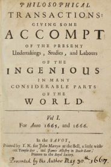

#  Introduction to Reproducible Reporting
30 Minutes

-------------------------

## Learning Objectives

* Discuss characteristics of a reproducible research report (also called 'executable research compendium' or 'Paper of the Future')
* Explore a real-life reproducible research report
* Install R packages needed to create a research report in RStudio
* Render a provided reproducible report to HMTL, docx, and HTML slides using Rstudio, Rmarkdown, and the knitr package

----------------------------------------------------

### Has the research paper changed much in the last ~400 years?

- _Philosophical Transactions of the Royal Society_ first published in 1665  
-  This first scientific journal established the important principles of scientific priority and peer review, which have become the central foundations of scientific journals ever since.

Source: Royal Society of London, <http://rstl.royalsocietypublishing.org/>

### Fast forward ~ 400 years

#### The scholarly record requires four key functions of a research report:
1. Registration of the author's claim
2. Certification that the research was conducted properly
3. Dissemination of the work to the right audiences
4. Preservation to ensure a permanent public record of the work that can be found and cited

(Rallison, S.P., 'What are Journals For?', _Ann R Coll Surg Engl._ 2015 Mar; 97(2): 89-91. DOI:10.1308/003588414X14055925061397)

*****

#### Why static PDFs are an underwhelming use of today's technology

We now have the tools to create a first class research report that meets these 4 requirements and is also Transparent, Re-Useable, and Reproducible. 

**A Reproducible Research Report **

1. Written and coded in plain text which is universally portable and readable by humans and machines
1. Combines text explanations with code and dynamically generated figures, tables, and plots, all in one executable file
1. Replaces static numbers, dates, and other values in the text with code that generates the most accurate and up-to-date values by the computer
1. Allows the author to work in the same environment used to write the code and analyze the data, and generate the plots and tables
1. They allow the author to compose one report and then compile/render it to many different outputs, depending on the need

#### Let's look at a reproducible report 

(Demo of example report)

We'll create our own in the next two days!  The first step in getting this dynamic document is making sure our software
  is set up correctly

*****
### Intro to Rstudio and the knitr package

Let's open Rstudio (Applications/Rstudio).  Rstudio is the development
environment where we'll be working on our document.  The main panel you'll see
on the left is the Console, where you can run R code.  On the right is two
panels - the upper contains your environment (what R can access), and the lower
contains the files on your computer.

The first thing to do is install some packages.  RStudio makes it easy to
install new packages to do things you want.  You can find packages by going to
the 'Packages' tab in the lower right panel.  You can install new packages by
clicking the Install button and typing in the package name.  For this workshop
we'll need the following packages:

- `tidyverse`
- `DT`
- `rorcid`
- `httpuv`

Let's get started by creating a new project.  Go to File/New Project and select
Existing Directory.  Browse to the data folder that your previously
downloaded and put on your Desktop and click Create Project.  

Now let's actually work with a document.  Click in the 'Files' tab in the lower
right panel of RStudio.  You'll see lots of files we will use during this lesson.  Double click on
`Base_2013_test.Rmd`.  

You'll see the document open in a new panel on the left hand side of the
screen.  In the top section of the document, replace the name with your own and change the date to today.  

Knitting is a process in Rstudio that takes a text document and turns it into
an output (like html, docx, or html slides).  Now click the knit button in the upper
left hand corner of the editor.    The first
time you do this you'll get a message that you need to install some packages.
You'll want to click Yes and wait for the packages to install.  Once the
installation you'll see an interactive demonstration document!

You can output this single file in multiple formats.  By default we've been be
generating .html files, but we can also output to a Word document.  If you
click on the downward arrow next to the knit button we see some default
formats.  Click on Word, and a Word document will appear.  

While pdf is an option, this requires a TeX distribution which is complex to
install and beyond the scope of  this course.

You can also select other output forms that aren't listed in the `knitr`
dropdown.  Take a look at the document.  You'll see in the top a section called
`output` with sections under it like `html_document`.  If we change the top
output knit will produce a different result.  Try replacing `word_document`
with `slidy_presentation`.  This is a html presentation that you can use in 
any web browser.

We'll continue working on this document to create a reproducible research report!

Next: [Basic Markdown](01-markdown.html)

